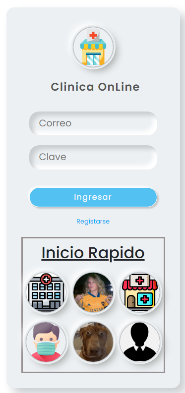
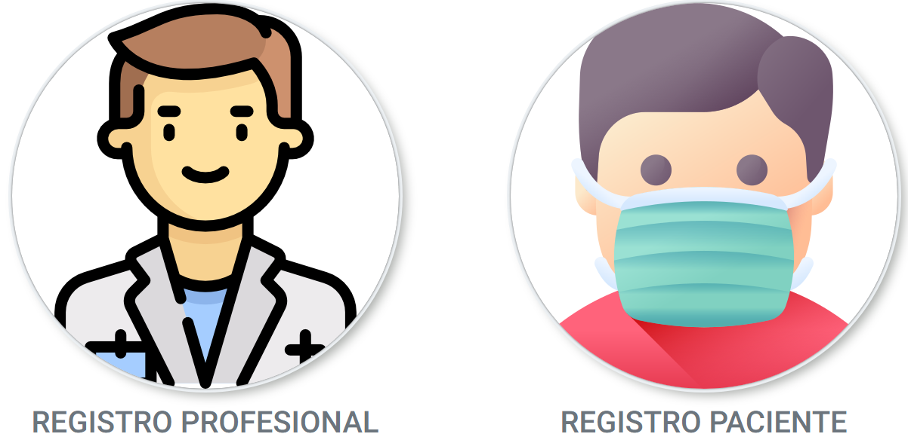
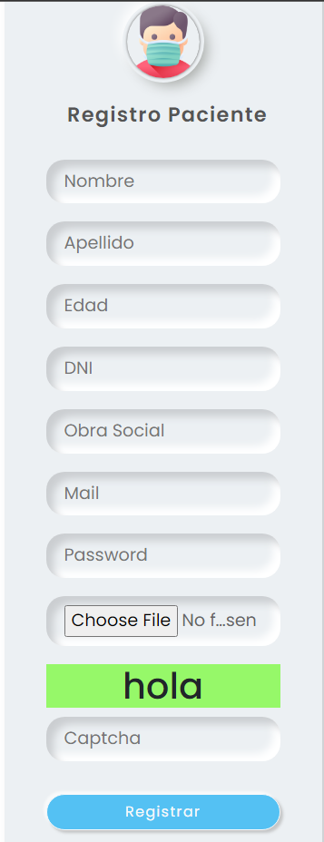
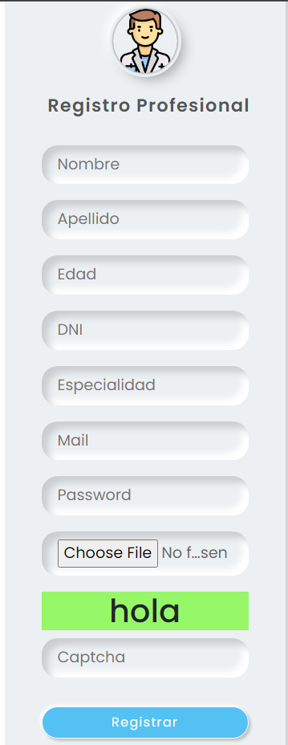
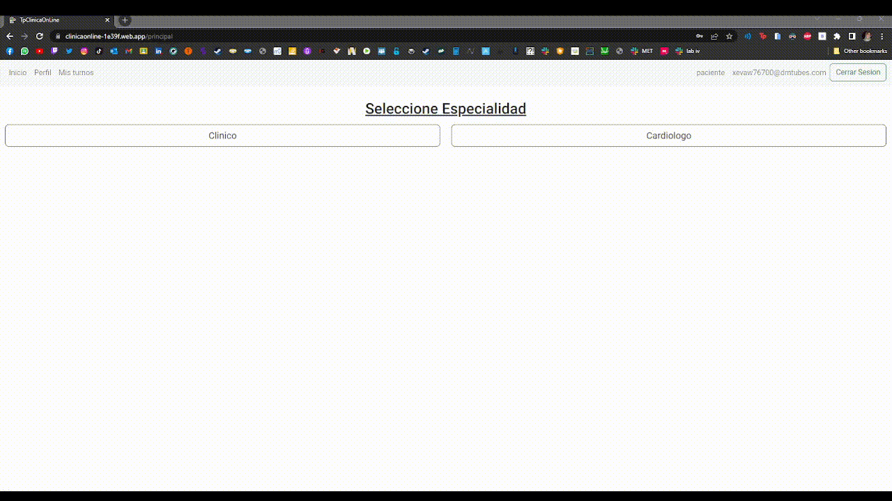
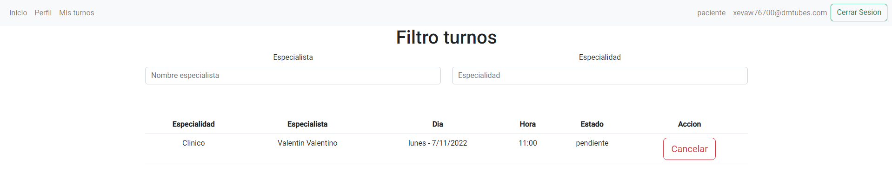

# Trabajo práctico - Laboratorio IV - Clinica OnLine

      

   

## **Link**
https://clinicaonline-1e39f.web.app/

### **Funcion principal**
La finalidad de dicho sistema es gestionar turnos de una clinica OnLine, solicitandolos y cambiando los estados del mismo segun corresponda.

 

      

Para iniciar a utilizar el sistema, primero debemos o logearnos si ya estamos registrados, o completar un formulario de registro correspondiente a si somos paciente o especialista.

 

<pre>
         
</pre>

Una vez iniciada la sesion, para solicitar un turno debemos realizar lo siguiente:

    
<pre>
         
</pre>

Una vez solicitado el turno, podremos visualizarlo en la seccion "mis turnos" como se muestra a continuacion.

<pre>
     
</pre>